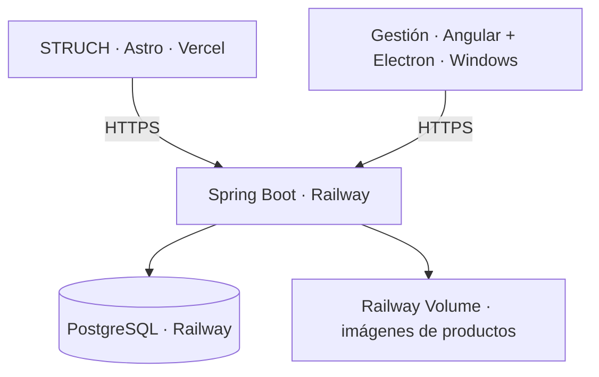

# STRUCH - Sistema de Gestión + Ecommerce

Proyecto Full Stack compuesto por una tienda pública de hardware y una aplicación de escritorio para gestionar inventario, pedidos y ventas. Ambos clientes comparten un backend y una base de datos cloud: disponibilidad, precios y operaciones se mantienen centralizados.

**[🌐 Tienda online](https://struch.vercel.app)** · **[💻 Descargar Gestión para Windows](https://github.com/MijahelPersonal/Full---Stack/releases/download/v0.1.0-demo/SistemaGestion-Setup.exe)** · **[Backend API](https://backend-production-cd4a.up.railway.app/api)** · **[Health](https://backend-production-cd4a.up.railway.app/api/health)**

## Descargar aplicación

[**Descargar SistemaGestion para Windows**](https://github.com/MijahelPersonal/Full---Stack/releases/download/v0.1.0-demo/SistemaGestion-Setup.exe)

[STRUCH v0.1.0 Demo — notas de la Release](https://github.com/MijahelPersonal/Full---Stack/releases/tag/v0.1.0-demo) · Windows x64 · aproximadamente 110 MiB · requiere conexión a Internet.

## Arquitectura



STRUCH atiende a los clientes desde el navegador; Gestión permite a los empleados administrar la operación desde Windows. Spring Boot valida permisos, calcula totales y controla el stock mediante transacciones. PostgreSQL almacena los datos comerciales y las rutas de imágenes; los archivos se guardan en un Volume persistente, separados de la base.

La aplicación Windows se conecta al mismo API HTTPS que utiliza la tienda. El backend y PostgreSQL no se empaquetan dentro del instalador.

## Funcionalidades

| STRUCH · tienda pública | Gestión · operación interna |
| --- | --- |
| Catálogo, categorías y marcas | Inicio con indicadores y datos reales |
| Búsqueda, filtros y detalle de producto | Productos e imágenes |
| Carrito con precios y disponibilidad actuales | Inventario, entradas, salidas y movimientos |
| Registro y login de clientes | Venta en tienda / POS |
| Mi cuenta e historial de pedidos | Gestión de pedidos web |
| Código y constancia de pedido imprimible | Clientes y control por roles |
| Consulta del estado y recojo en tienda | Historial de ventas POS/WEB |
| | Reportes básicos y control de stock |

### Flujo del negocio

1. El cliente entra a STRUCH, agrega productos al carrito e inicia sesión.
2. Genera un pedido para **recojo en tienda** y obtiene un código `STR-...` y su constancia.
3. El pedido aparece en Gestión. El administrador confirma y el sistema reserva stock.
4. El pedido se marca listo para recoger; el cliente consulta su estado desde Mi cuenta.
5. En tienda, el empleado busca y valida el código antes de entregar.
6. La entrega registra una **Venta WEB** y actualiza los reportes. No descuenta el stock por segunda vez.

Las ventas físicas se registran desde **Venta en tienda / POS**, generan **Venta POS** y descuentan stock en la misma transacción que crea el detalle y los movimientos. Cancelar un pedido reservado libera su stock; cancelar uno pendiente no modifica existencias.

Esta demo no incluye pagos online, facturación electrónica, devoluciones ni múltiples almacenes. La compra web funciona mediante pedidos y recojo, sin cobro online. Las marcas y productos del catálogo de demostración no implican afiliación con fabricantes.

## Tecnologías

| Área | Tecnologías utilizadas |
| --- | --- |
| Backend | Java 17, Spring Boot 4, Spring Security, JWT, Spring Data JPA / Hibernate, Maven |
| Datos | PostgreSQL 18; scripts SQL aditivos e idempotentes mediante Spring SQL initialization |
| Gestión | Angular 22, TypeScript, Electron 44 |
| Tienda | Astro 7, TypeScript / JavaScript, Tailwind CSS 4, Sharp para imágenes |
| Cloud | Railway, PostgreSQL Railway, Railway Volume y Vercel |
| Desarrollo y distribución | Git, GitHub y GitHub Releases |

Las migraciones actuales usan el inicializador SQL de Spring y Hibernate valida el esquema. No se utiliza Flyway. Las interacciones visuales usan CSS y JavaScript; no se utiliza GSAP.

## Capturas

### Catálogo público en producción


### Gestión instalada en Windows


Las capturas muestran la versión desplegada y la aplicación instalada; no incluyen contraseñas, tokens ni configuración privada.

## Aplicación de escritorio

1. Descargar `SistemaGestion-Setup.exe` desde GitHub Release.
2. Ejecutar el instalador y completar las confirmaciones que solicite Windows.
3. Abrir **SistemaGestion**.
4. Iniciar sesión con una cuenta interna autorizada.

No requiere instalar Java, PostgreSQL, Node.js ni IntelliJ. **Requiere conexión a Internet**, porque utiliza el backend y la base de datos cloud.

Versión Windows x64. El instalador de esta demo no tiene firma Authenticode; no se deben desactivar ni saltar las protecciones de Windows. Las cuentas de empleados son administradas internamente: el registro público de STRUCH crea cuentas de clientes, no cuentas administrativas. No se publican credenciales de acceso en este repositorio.

## Organización del repositorio

```text
Backend/                  Spring Boot, seguridad, servicios, SQL y pruebas
Frontend/                 Angular y Electron para Gestión
Web/frontend/             Tienda pública Astro
Web/product-images-library/  Biblioteca de imágenes del catálogo demo
Web/demo-product-images/  Recursos visuales demo conservados
Web/tools/demo/           Herramientas de carga del catálogo demo
tools/deployment/         Traslado y validación cloud
docs/images/              Capturas para documentación
```

El instalador se distribuye como **Asset de GitHub Release**, fuera del historial Git. Builds, dependencias, uploads locales, backups, logs y archivos `.env` reales están excluidos.

## Desarrollo local

Requisitos para desarrollar: Java 17 o compatible, Maven Wrapper, Node.js 24, npm y PostgreSQL. Para utilizar la aplicación instalada solo se necesita Windows e Internet.

### Backend

Desde `Backend/`, crear la configuración privada local siguiendo `Backend/.env.example`, configurar una base PostgreSQL y ejecutar:

```powershell
./mvnw.cmd spring-boot:run
```

### Gestión Angular / Electron

Desde `Frontend/`:

```powershell
npm ci
npm start                 # Angular web
npm run electron:dev      # Angular + Electron en desarrollo
```

El backend local se ejecuta por separado. La configuración desktop de producción exige una URL pública HTTPS; el renderer no recibe credenciales de base de datos ni el secreto JWT.

### Tienda Astro

Desde `Web/frontend/`, configurar `.env` siguiendo `.env.example`:

```powershell
npm ci
npm run dev
```

Consultar [la guía de despliegue](DEPLOYMENT.md) para las variables y comandos de producción. Las pruebas de persistencia deben usar la base aislada `gestor_mvp_test`, nunca la base habitual ni producción. La prueba cloud que crea un pedido es explícita; las comprobaciones de instalación son de lectura.

## Seguridad

- Autenticación de empleados y clientes separada; permisos comprobados en Spring Boot.
- Estado actual del usuario consultado en cada petición autenticada: desactivar una cuenta invalida su acceso incluso con un JWT previo.
- Cuentas web con cookies HttpOnly, Secure bajo HTTPS y SameSite=Lax; operaciones web comprueban el origen.
- Electron con `nodeIntegration: false`, `contextIsolation: true` y `sandbox: true`.
- Precios, totales, disponibilidad y transiciones de pedido validados por el backend.
- Imágenes opcionales validadas por formato, contenido y tamaño; archivos en almacenamiento controlado, sin BLOB grandes.
- Secretos únicamente en configuración privada y variables cloud. El instalador conoce solo la URL pública del API.

## Estado del proyecto

| Componente | Estado |
| --- | --- |
| STRUCH online | ✅ |
| Backend cloud | ✅ |
| PostgreSQL cloud y Volume | ✅ |
| Gestión Windows instalada y probada | ✅ |
| Pedidos web | ✅ |
| Inventario compartido | ✅ |

Demo inicial desplegada. Se mantienen documentados el aviso de tamaño CSS del login, la ausencia de firma Windows y un advisory transitivo sin versión corregida. La validación completa y sus límites están en el informe técnico.

## Documentación

- [Preparación y comandos de despliegue](DEPLOYMENT.md)
- [Resultado del despliegue real y validaciones](DEPLOYMENT-RESULTADO.md)
- [Arquitectura y transacciones de pedidos web](Web/PEDIDOS-WEB.md)
