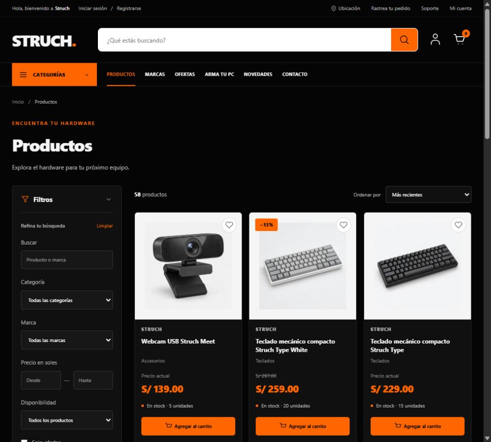
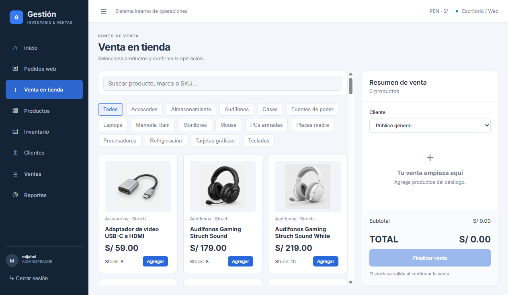

# STRUCH - Sistema de Gestión + Ecommerce

Tienda pública de hardware y aplicación Windows para gestionar inventario, pedidos y ventas. Una solución integrada para que los clientes realicen pedidos y el personal administre la operación de la empresa.

**[🌐 Ver tienda](https://struch.vercel.app)** · **[💻 Descargar aplicación para Windows](https://github.com/MijahelPersonal/Full---Stack/releases/download/v0.1.0-demo/SistemaGestion-Setup.exe)**

## Aplicación para Windows

[**Descargar SistemaGestion-Setup.exe**](https://github.com/MijahelPersonal/Full---Stack/releases/download/v0.1.0-demo/SistemaGestion-Setup.exe)

[STRUCH v0.1.0 Demo](https://github.com/MijahelPersonal/Full---Stack/releases/tag/v0.1.0-demo) · Windows x64 · aproximadamente 110 MiB.

1. Descargar el instalador.
2. Ejecutarlo y completar las confirmaciones de Windows.
3. Abrir **SistemaGestion**.
4. Iniciar sesión con una cuenta interna autorizada.

No requiere instalar Java, PostgreSQL ni Node.js. **Requiere conexión a Internet.**

El instalador de esta demostración no tiene firma digital de Windows. No desactives ni saltes las protecciones del sistema. Las credenciales administrativas no se publican.

## Funcionalidades

| Tienda STRUCH | Aplicación de gestión |
| --- | --- |
| Catálogo, categorías y marcas | Inicio con indicadores y datos reales |
| Búsqueda, filtros y detalle de producto | Administración de productos e imágenes |
| Carrito | Inventario y movimientos de existencias |
| Registro e inicio de sesión de clientes | Venta en tienda / POS |
| Mi cuenta e historial de pedidos | Gestión de pedidos web |
| Código y constancia de pedido | Clientes y permisos por rol |
| Seguimiento y recojo en tienda | Historial de ventas POS/WEB y reportes |

## Cómo funciona

1. El cliente visita STRUCH, agrega productos al carrito e inicia sesión.
2. Realiza un pedido para **recojo en tienda** y recibe un código y su constancia.
3. El personal consulta el pedido en Gestión; el administrador lo confirma y reserva las existencias.
4. El pedido se marca listo y el cliente consulta su estado desde Mi cuenta.
5. En tienda se valida el código y se entrega el pedido.
6. Se registra una **Venta WEB** y se actualizan los reportes.

Las ventas físicas se registran desde **Venta en tienda / POS**, generan una **Venta POS** y actualizan el inventario compartido. La entrega de un pedido reservado no descuenta existencias por segunda vez.

Esta demostración utiliza pedidos con recojo en tienda. No incluye pagos en línea, facturación electrónica, devoluciones ni múltiples almacenes. Los productos del catálogo de demostración no implican afiliación con fabricantes.

## Tecnologías

| Área | Tecnologías |
| --- | --- |
| Servicios y seguridad | Java, Spring Boot, Spring Security, JWT, Spring Data JPA y Maven |
| Aplicación de gestión | Angular, TypeScript y Electron |
| Tienda pública | Astro, TypeScript, JavaScript, Tailwind CSS y Sharp |
| Desarrollo y distribución | Git, GitHub y publicaciones de versiones |

## Capturas

### Catálogo STRUCH

### Aplicación de gestión en Windows

## Estado

- Tienda STRUCH disponible ✅
- Aplicación Windows instalada y probada ✅
- Pedidos con recojo en tienda ✅
- Inventario compartido ✅
- Ventas POS/WEB y reportes básicos ✅

## Documentación técnica

La configuración de despliegue y las comprobaciones técnicas se mantienen separadas de esta presentación:

- [Guía de despliegue](DEPLOYMENT.md)
- [Resultado y validaciones](DEPLOYMENT-RESULTADO.md)
